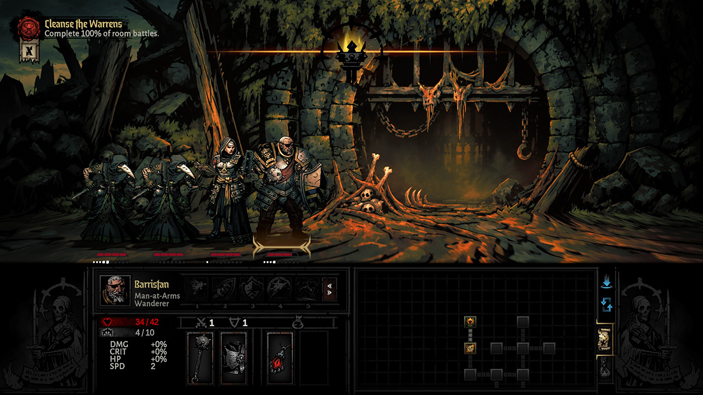
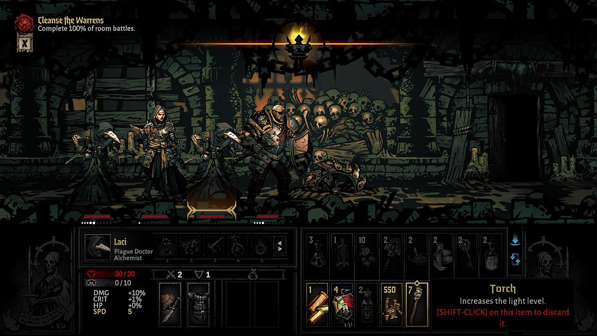
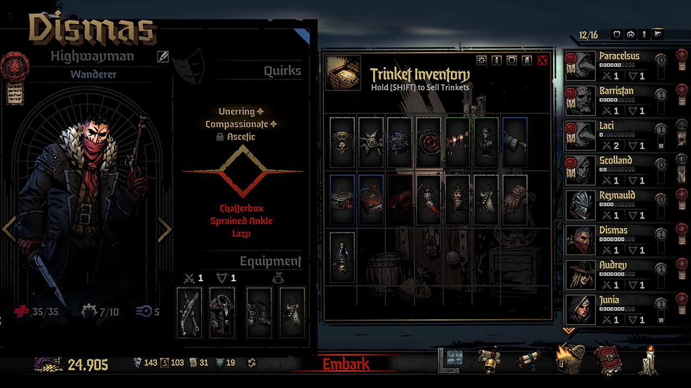

# DD2 Estate

A game mode for **Darkest Dungeon II** that plays like **Darkest Dungeon** (the first game): the Hamlet and its
buildings, the weekly loop, the Estate Map, provisioning, corridor-and-room dungeons with torchlight, curios,
traps, hunger and camping, the Ancestor's story — with Darkest Dungeon II's heroes, paths, skills, combat,
monsters, bosses, trinkets and quirks.

> **Early version.** It can be played from the first week on, but it is not finished: see "What is not done".
> **Use a fresh profile only, or keep backups of your saves.**

## What you need

- **[Darkest Dungeon II](https://store.steampowered.com/app/1940340/Darkest_Dungeon_II/)** (Steam, tested on
  2.04.85095): the game the mod runs in.
- **[Darkest Dungeon](https://store.steampowered.com/app/262060/Darkest_Dungeon/)** (the first game) installed on
  the same PC. The mod contains **no** files of either game:
  every picture, layout, rule table, line of the Ancestor's and sound of the first game is read, while you play,
  from *your* install.
- **[BepInEx](https://github.com/BepInEx/BepInEx/releases) 5.4.23.x (x64, Mono)** in the Darkest Dungeon II
  folder ([how to install it](https://docs.bepinex.dev/articles/user_guide/installation/index.html)).

## Install

1. Install [BepInEx 5 (x64)](https://github.com/BepInEx/BepInEx/releases) into the Darkest Dungeon II folder (the one with `Darkest Dungeon II.exe`) and start
   the game once so BepInEx makes its folders.
2. Copy the `DD2Estate` folder (with `DD2Estate.dll`) into `BepInEx\plugins\`.
3. Start the game. The main menu has a new entry, **Estate**, under Confessions and Kingdoms.

Darkest Dungeon is found by itself when it is in a Steam library. If it is not found, the mod asks for its folder
when you press Estate; the folder can be changed later in the options.

To remove the mod, delete `BepInEx\plugins\DD2Estate`. The estate lives in a profile of its own; your own
profiles, saves and achievements are not touched, and achievements are off while the Estate is running.

## How it plays

- **Estate → Continue / New Estate.** One estate is kept; founding a new one abandons the old (asked twice).
- **The Hamlet.** Stage Coach (recruits every week, each on a hero path), Tavern and Abbey (stress), Sanitarium
  (quirks and diseases), Guild (skills), Blacksmith (weapon and armour levels), Survivalist (camping skills),
  Nomad Wagon (trinkets), Graveyard, the Ancestor's memoirs. Buildings are upgraded with heirlooms; gold and
  prices are Darkest Dungeon's.
- **Embark.** The Estate Map offers the week's quests by Darkest Dungeon's rules. Provision, then walk the
  dungeon: `A` / `D` or hold the mouse to walk, click a room on the map to go there, click curios, use items from
  the bag, camp with firewood on medium and long quests.
- **Fights** are Darkest Dungeon II's, against its factions, scaled to the quest's level. A button beside the
  skills shows the party's bag.
- **A hero's sheet** (right click on a hero): skills, camping skills, equipment, trinkets, and in the Hamlet the
  hero's look.
- A week passes after every expedition; dead heroes stay dead.

**Settings** are in the game's own options while the Estate is running, on the tab **Estate**.

## What is not done

- Fights and prices are not balanced yet.
- The Darkest Dungeon is a stand-in: five boss fights in a row. There is no ending.
- Not tried: screens that are not 16:9, a controller, a Darkest Dungeon that is not from Steam, languages other
  than English (the mod's own words are English).
- Made for game version 2.04.85095; an update of the game may break parts of it.

Found a fault? Open an issue on the mod's GitHub page ([Issues](../../issues)) and attach `BepInEx\LogOutput.log` from the
game's folder: it says what happened. Changes and known issues: `CHANGELOG.md`.

## For modders

The source is in `src/DD2Estate` (C#, Harmony); `docs/DESIGN.md` describes how it is put together and
`docs/recon/*.md` what was learned about both games. Build with the [.NET SDK](https://dotnet.microsoft.com/download):
`dotnet build src/DD2Estate/DD2Estate.csproj -c Release` (the game's DLLs are referenced in place: see
`Directory.Build.props`). `tools/` holds test scripts and offline previews; they talk to a dev bridge inside the
mod that is off unless `[Dev] BridgePort` is set in `BepInEx\config\ph13.dd2.estate.cfg`.

## Licence and credits

- Darkest Dungeon and Darkest Dungeon II are by [Red Hook Studios](https://www.redhookgames.com/), and everything
  of theirs is theirs. This is an
  unofficial fan mod. With the mod's own code you may do anything you like: see `LICENSE.txt`.
- The few redrawn pictures in `assets/` are a demonstration only: see the notice beside them.
- [BepInEx](https://github.com/BepInEx/BepInEx) and [Harmony](https://github.com/pardeike/Harmony) by their
  authors.
- Built with AI assistance ([Claude Code](https://claude.com/claude-code), with the
  [universal-modder](https://github.com/rehan-remade/universal-modder) toolkit).

## Screenshots

